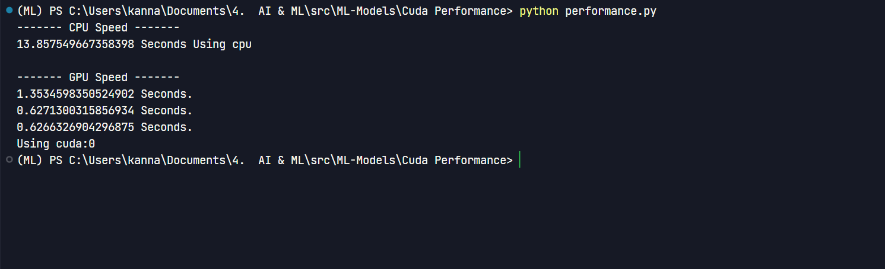

# Parallel Computing

## Checking the performance difference between CPU and GPU using Cuda

| CPU | GPU |
| --- | --- |
| Ryzen 5 3500H | GTX 1650 |

### The [Test](./Cuda_Pytorch_test.py) file is used to verify whether Cuda is working or not

### Testing for 32 X 250 matrix multiplication

```python
CPU Computing time  = 13.857549 seconds
GPU Computing time  = 0.6266326 seconds

```


